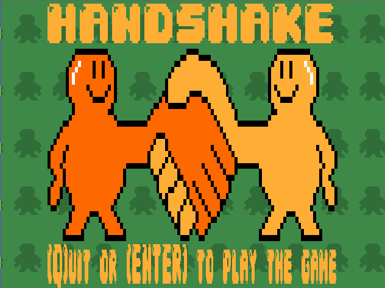
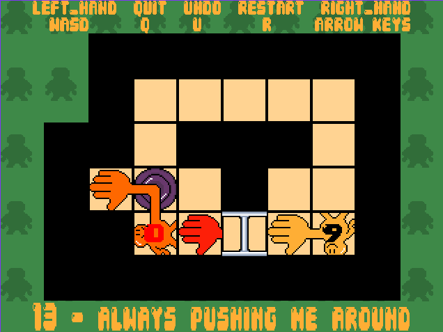
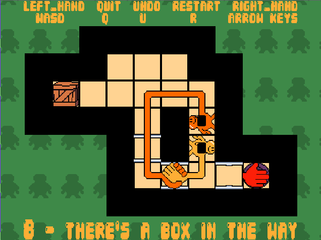
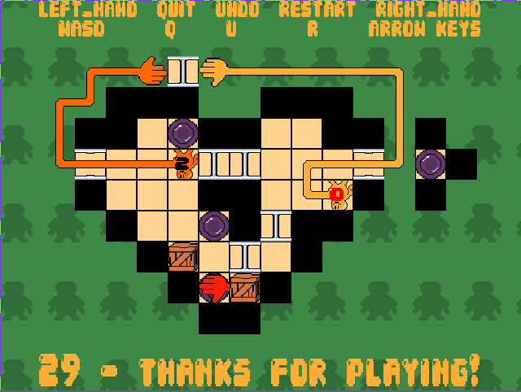
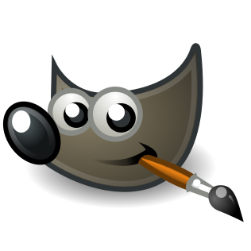

# FOSS-Shake
FOSS-Shake is a Free and Open source almost 1:1 clone of
the 30 level sokoban puzzle game [Handshakes](https://petpumpkin.itch.io/handshakes)
the original game was made for the Game jam "Lost Relic Games" by
[Damaskino](https://itch.io/profile/damaskino),
[Trumpetguy](https://www.youtube.com/channel/UCZ5puY_5lOTDKl6EAPeTuFg),
[Pet Pumpkin](https://petpumpkin.itch.io/) and recently
[Barry Lawnmover](https://barrylawnmower.itch.io/) for android support on
the Google playstore.



# Gameplay
| Body push                     | Handshake                     | Last level
| :---:  		                | :---:    		                | :---:
| | | 

## Keys

- `Left player:  (w a s d)`
- `Right player: (h j k l) Vim or (↑ ← ↓ →) Cursor`
- `(u) Undo move`
- `(r) Restart game`
- `(q) or (esc) to exit.`

# Requeriments
- GNU/Linux (Tested on debian 12)
- GNU make
- GCC
- pkg-config
- SDL libraries (sdl2-dev, sdl2-image-dev, sdl2-ttf-dev and sdl2-mixer-dev)
```sh
# Debian 12
sudo apt-get install pkg-config \
                        libsdl2-dev \
                        libsdl2-image-dev \
                        libsdl2-ttf-dev \
                        libsdl2-mixer-dev
```
- Support to open XCF files (This will work on newer distros, old distros like
debian 10 do not open XCF files because of old sdl2 versions.)

# Compiling, running and cleaning.
```sh
make        #
make run    # ./handshake levels/
make clean  # rm handshake objs/*.o
```
# Made using
| Programming language | Graphics Library | Graphic design |
| :---:  		       | :---:    		  | :---:          |
| [](https://www.open-std.org/jtc1/sc22/wg14/www/docs/n3220.pdf) | [](https://www.libsdl.org) | [](https://www.gimp.org) |

## Made by [Sivefunc](https://gitlab.com/sivefunc)
## Licensed under [GPLv3](LICENSE)
